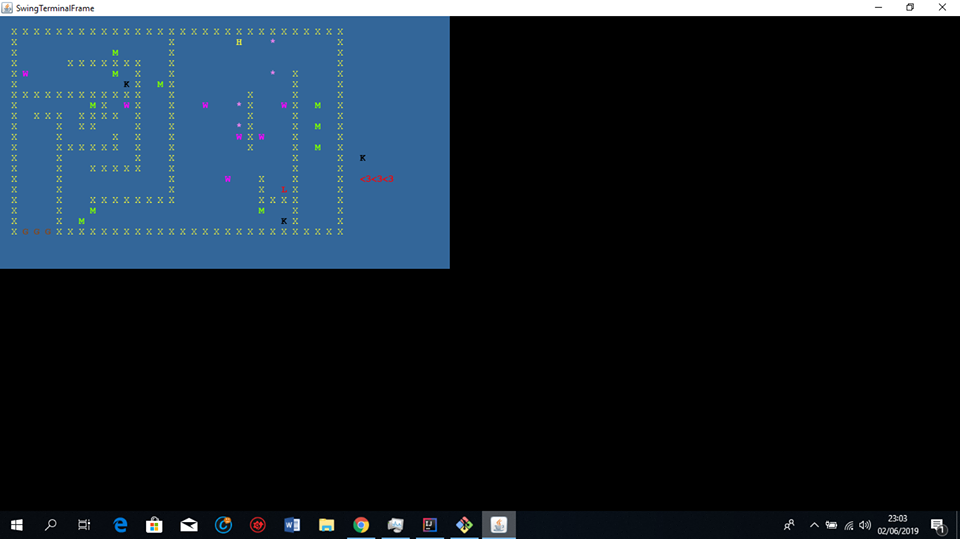

# FEUP-LPOO
Project developed for the LPOO (Object Oriented Programming Laboratory) course unit.

In this platform game you can help our hero escape the castle by pulling the lever or collecting a key that opens the gates throughout three different levels in which you will encounter all kinds of foes, from always watchful guards to reckless ogres.

## Screenshots

## Install Instructions

To install this game, clone this repository and run the program from an IDE.
